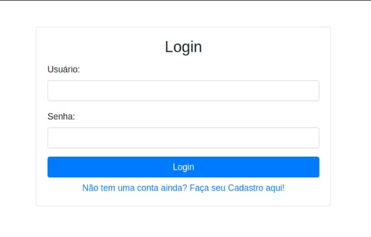
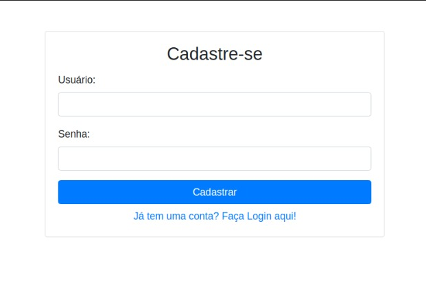
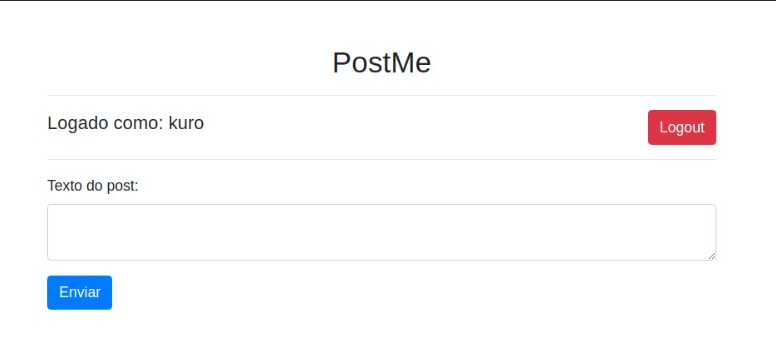
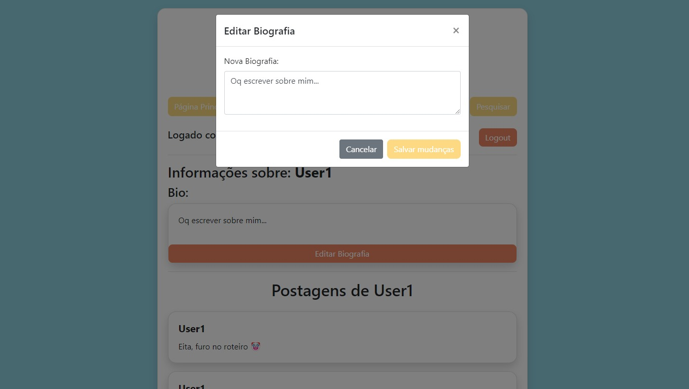
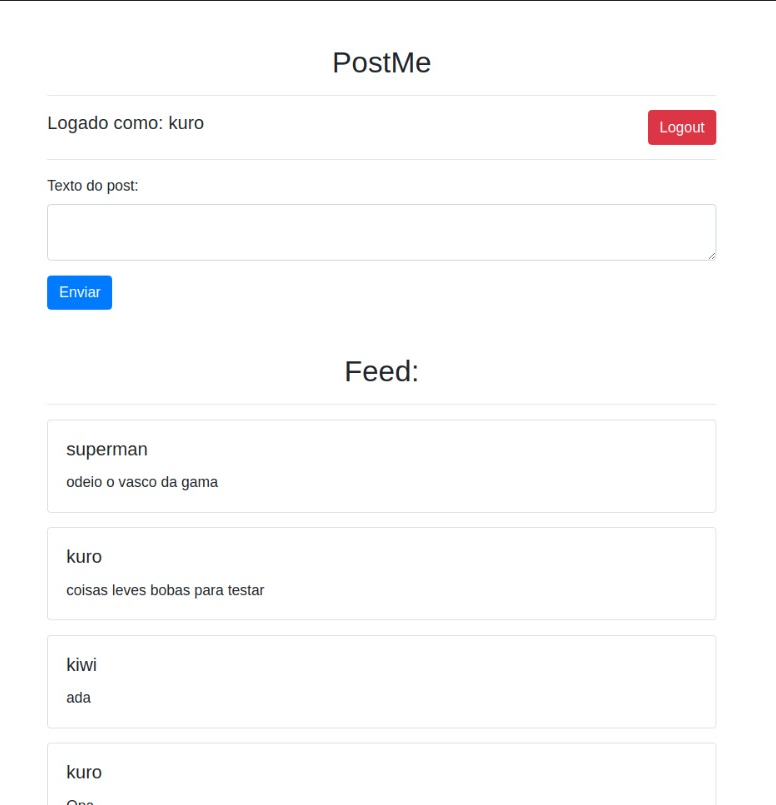

# Engenharia de Software - 2024.1 | Universidade Federal do Tocantins
Curso: Bacharelado em Ciência da Computação
Professor: Edeilson Milhomem da Silva
Time: [Henrique Noronha Fernandes](https://github.com/henrique-noronha), [Caio Christhian](https://github.com/CaioChristhian), [Eduardo Henrique](https://github.com/Kiwitheprogrammer).
## PostMe
### Descrição

O PostMe é uma plataforma inovadora que permite aos usuários expressarem-se livremente, publicando textos em um feed dinâmico e interativo. Seja você um escritor aspirante buscando uma audiência para seus textos, ou simplesmente alguém que deseja compartilhar pedaços do seu dia-a-dia, o PostMe é o lugar perfeito para você.

### Requisitos funcionais do projeto:

1. **Feature RF01 - [Login do Usuário](https://github.com/CaioChristhian/ES-2024_1-PostMe/tree/feature/RF01):** Documentação adicionada por [Cayke Daniel Pereira Veras](https://github.com/cayke1) e revisada por [Caio Christhian](https://github.com/CaioChristhian/ES-2024_1-PostMe/tree/feature/RF01).
2. **Feature RF02 - [Cadastro do Usuário](https://github.com/CaioChristhian/ES-2024_1-PostMe/tree/feature/RF02):** Documentação adicionada por [Caio Christhian Lopes Silva](https://github.com/CaioChristhian) e revisada por [Cayke Daniel Pereira Veras](https://github.com/cayke1).
3. **Feature RF03 - [Publicações](https://github.com/CaioChristhian/ES-2024_1-PostMe/tree/4b1c7e693bfa59e7ef738dcaffe54e9a84a94d1b):** Documentação adicionada por [Henrique Noronha Fernandes](https://github.com/henrique-noronha) e revisada por [Caio Christhian](https://github.com/CaioChristhian/ES-2024_1-PostMe/tree/4b1c7e693bfa59e7ef738dcaffe54e9a84a94d1b).
4. **Feature RF04 - [Editar Perfil](https://github.com/CaioChristhian/ES-2024_1-PostMe/tree/feature/RF04):** Documentação adicionada por [Caio Christhian Lopes Silva](https://github.com/CaioChristhian) e revisada por [Cayke Daniel Pereira Veras](https://github.com/cayke1).
5. **Feature RF05 - [Listagem de Publicações no Feed](https://github.com/CaioChristhian/ES-2024_1-PostMe/tree/feature/RF05):** Documentação adicionada por [Eduardo Henrique Coelho Ramos](https://github.com/Kiwitheprogrammer) e revisada por [Caio Christhian](https://github.com/CaioChristhian/ES-2024_1-PostMe/tree/feature/RF05).


### Definindo os requisitos e seus colaboradores.

##  Realizar Login do Usuário
### Descrição 
Realizar o login do usuário na plataforma. Permitir que um usuário cadastrado acesse as funcionalidades do site através de seu login e senha. O processo de login deve ser seguro e acessível para o usuário.

### Features:  
[RF01](https://github.com/CaioChristhian/ES-2024_1-PostMe/tree/feature/RF01). 

[Login](https://github.com/CaioChristhian/ES-2024_1-PostMe/tree/feature/login) Autor: [Cayke Daniel Pereira Veras](https://github.com/cayke1). Revisor: [Caio Christhian Lopes Silva](https://github.com/CaioChristhian). 

[Config-database](https://github.com/CaioChristhian/ES-2024_1-PostMe/tree/feature/config-database) Autor: [Caio Christhian Lopes Silva](https://github.com/CaioChristhian). Revisor: [Henrique Noronha Fernandes](https://github.com/henrique-noronha).

[Login.php](https://github.com/CaioChristhian/ES-2024_1-PostMe/blob/develop/login.php) Autor: [Eduardo Henrique Coelho Ramos](https://github.com/Kiwitheprogrammer). Revisor: [Caio Christhian](https://github.com/CaioChristhian).

[Index.php](https://github.com/CaioChristhian/ES-2024_1-PostMe/blob/develop/index.php) Autor: [Eduardo Henrique Coelho Ramos](https://github.com/Kiwitheprogrammer). Revisor: [Henrique Noronha Fernandes](https://github.com/henrique-noronha).

### Protótipo de Tela 1


### Protótipo de Tela 2


##  Realizar Cadastro do Usuário
### Descrição  
Realizar o cadastro do usuário na plataforma. Permitir que um usuário interessado em acessar as funcionalidades do site possa se cadastrar no sistema, desde que não tenha um cadastro prévio. O processo de cadastro deve ser acessível e intuitivo para o usuário.

### Features: 
[RF02](https://github.com/CaioChristhian/ES-2024_1-PostMe/tree/feature/RF02) 

[register](https://github.com/CaioChristhian/ES-2024_1-PostMe/tree/feature/register) Autor: [Caio Christhian Lopes Silva](https://github.com/CaioChristhian). Revisor: [Cayke Daniel Pereira Veras](https://github.com/cayke1).

[Config-database](https://github.com/CaioChristhian/ES-2024_1-PostMe/tree/feature/config-database) Autor: [Caio Christhian Lopes Silva](https://github.com/CaioChristhian). Revisor: [Henrique Noronha Fernandes](https://github.com/henrique-noronha).

[register.php](https://github.com/CaioChristhian/ES-2024_1-PostMe/blob/develop/register.php) Autor: [Eduardo Henrique Coelho Ramos](https://github.com/Kiwitheprogrammer). Revisor: [Henrique Noronha Fernandes](https://github.com/henrique-noronha).

### Protótipo de Tela


### Protótipo de Tela 2


##  Realizar Publicação
### Descrição 
Realizar a publicação de  textos na plataforma. Permitir que os usuários publiquem textos em um feed dinâmico e interativo na plataforma.

### Features:
[RF03](https://github.com/CaioChristhian/ES-2024_1-PostMe/tree/4b1c7e693bfa59e7ef738dcaffe54e9a84a94d1b).

[posts-com-dados-de-usuario](https://github.com/CaioChristhian/ES-2024_1-PostMe/tree/feature/posts-com-dados-do-usuario). Autor: [Caio Christhian Lopes Silva](https://github.com/CaioChristhian). Revisor: [Henrique Noronha Fernandes](https://github.com/henrique-noronha).

### Protótipo de Tela


### Protótipo de Tela 2


##  Editar Perfil do Usuário
## Descrição 
Permitir que um usuário cadastrado e logado possa editar as informações de seu perfil no sistema. O processo de edição deve ser simples e intuitivo.

### Features:

[RF04](https://github.com/CaioChristhian/ES-2024_1-PostMe/tree/feature/RF04)

[profile](https://github.com/CaioChristhian/ES-2024_1-PostMe/tree/profile) Autor: [Eduardo Henrique Coelho Ramos](https://github.com/Kiwitheprogrammer). Revisor: [Caio Christhian Lopes Silva](https://github.com/CaioChristhian).

### Protótipo de Tela





## Listagem de Publicações no Feed

### Descrição  
Exibir uma lista de publicações no feed principal da plataforma, permitindo que os usuários vejam conteúdo compartilhado por outros usuários. Permitir que os usuários visualizem as publicações realizadas por outros usuários em um feed dinâmico e interativo.

### Features:

[RF05](https://github.com/CaioChristhian/ES-2024_1-PostMe/tree/feature/RF05)

[home-listagem](https://github.com/CaioChristhian/ES-2024_1-PostMe/tree/feature/home-listagem) Autor: [Henrique Noronha Fernandes](https://github.com/henrique-noronha). Revisor: [Eduardo Henrique Coelho Ramos](https://github.com/Kiwitheprogrammer)

### Protótipo de Tela


### Protótipo de Tela 2

 
## Relatório de Gestão

### Concluído até 02/04/2024
1. **Planejamento no Draw.io:** Concluído por todos os membros do grupo.
   - [EventStorm](https://drive.google.com/file/d/11TrkXos6DFXIQ8DXCn1a3aGZc7uVvkC4/view)

### Iteração 1 - 17/04/2024
 **Valor:** Esta fase do projeto representa a transição crucial do planejamento inicial para a execução prática. Durante esta etapa, é possível visualizar tanto a tela de login quanto a tela de posts, além de realizar a configuração completa do banco de dados.
1. **Nova Feature - [Tela de Login](https://github.com/CaioChristhian/ES-2024_1-PostMe/tree/feature/login):** Desenvolvida por [Cayke Daniel Pereira Veras](https://github.com/cayke1). Revisado por [Caio Christhian](https://github.com/CaioChristhian).
2. **Nova Feature - [Listagem de Posts](https://github.com/CaioChristhian/ES-2024_1-PostMe/tree/feature/home-listagem):** Desenvolvida por [Henrique Noronha Fernandes](https://github.com/henrique-noronha). Revisado por [Caio Christhian](https://github.com/CaioChristhian).
3. **Nova Feature - [Configuração do Banco de Dados](https://github.com/CaioChristhian/ES-2024_1-PostMe/tree/feature/config-database):** Desenvolvida por [Caio Christhian](https://github.com/CaioChristhian). Revisada por [Henrique Noronha Fernandes](https://github.com/henrique-noronha).

### Iteração 2 06/05/2024
 **Valor:** Foram realizadas as seguintes alterações: implementação de um redirecionamento automático para a página de login quando o usuário não estiver logado, adição de um link que direciona o usuário à página de registro caso ele ainda não possua uma conta, e melhorias visuais nas telas para aprimorar a experiência do usuário.
1. **Alteração [Index.php](https://github.com/CaioChristhian/ES-2024_1-PostMe/blob/develop/index.php):** Redirecionamento para login.php se o usuário não estiver logado, por [Eduardo Henrique](https://github.com/Kiwitheprogrammer).  Revisado por [Caio Christhian](https://github.com/CaioChristhian).
2. **Alteração [Register.php](https://github.com/CaioChristhian/ES-2024_1-PostMe/blob/develop/register.php):** Página simplificada para cadastro com link para login, por [Eduardo Henrique](https://github.com/Kiwitheprogrammer). Revisada por [Henrique Noronha Fernandes](https://github.com/henrique-noronha).
3. **Alteração [Login.php](https://github.com/CaioChristhian/ES-2024_1-PostMe/blob/develop/login.php):** Visual alterado e link para registro adicionado, por [Eduardo Henrique](https://github.com/Kiwitheprogrammer). Revisado por [Caio Christhian](https://github.com/CaioChristhian).

### Iteração 3 - 21/05/2024
**Valor:** O valor desta iteração está na divisão da aplicação em três camadas distintas: a camada de interação do usuário (view), a camada de manipulação dos dados (model) e a camada de controle (controller). Além disso, houve uma revisão da documentação, tornando-a mais clara e fácil de compreender.
1.  **Simplificar a Iteração do Projeto:** Concluído por [Henrique Noronha Fernandes](https://github.com/henrique-noronha). Revisado por [Caio Christhian](https://github.com/CaioChristhian).
2. Restruturação da Aplicação para o [Padrão MVC](https://github.com/CaioChristhian/ES-2024_1-PostMe/tree/feature/refatorando-para-o-padrao-mvc) e adição de sessions à aplicação. Desenvolvida por [Caio Christhian](https://github.com/CaioChristhian) e Revisada por [Henrique Noronha Fernandes](https://github.com/henrique-noronha).
3. Aprimorar [tela do usuário](https://github.com/CaioChristhian/ES-2024_1-PostMe/commit/8b58a4a28c5970c4082dff447949490d8e374572). Desenvolvido por [Eduardo Henrique](https://github.com/Kiwitheprogrammer). Revisado por [Caio Christhian](https://github.com/CaioChristhian).

### Iteração 4 - 05/06/2024
**Valor:** Nesta iteração, vamos melhorar as páginas de login e registro, corrigir problemas no registro de usuários e garantir que os posts sejam publicados corretamente com os dados dos usuários. Isso significa tornar as páginas de login e registro mais fáceis de usar, consertar qualquer erro que impeça os usuários de se registrarem e garantir que os posts sejam atribuídos às contas dos usuários corretamente.
1. [Aprimorar o Front-end da Pagina Login (login.php)](https://github.com/CaioChristhian/ES-2024_1-PostMe/commit/ccfdc48f2f4c7c061fa3b30465723ec2594485b5) Concluído por: [Eduardo Henrique](https://github.com/Kiwitheprogrammer). Revisado por [Caio Christhian](https://github.com/CaioChristhian).
2.[Validação da session, logout, dados do usuario no post](https://github.com/CaioChristhian/ES-2024_1-PostMe/commit/ccfdc48f2f4c7c061fa3b30465723ec2594485b5) Concluído por: [Caio Christhian](https://github.com/CaioChristhian). Revisada por [Henrique Noronha Fernandes](https://github.com/henrique-noronha).
3.[Estilizando feed, login e register](https://github.com/CaioChristhian/ES-2024_1-PostMe/commit/ccfdc48f2f4c7c061fa3b30465723ec2594485b5). Concluído por: [Henrique Noronha Fernandes](https://github.com/henrique-noronha). Revisado por: [Eduardo Henrique](https://github.com/Kiwitheprogrammer).

### Iteração 5 - 18/06/2024
**Valor:**  Corrigidos alguns erros críticos no sistema. Agora, ao tentar registrar um usuário que já existe, o sistema exibe uma mensagem de aviso e impede a duplicação no banco de dados. Também resolvido o problema que ocorria ao pesquisar por um usuário inexistente, fornecendo uma mensagem adequada. Além disso, corrigido o erro que acontecia quando um usuário errava as credenciais de login, exibindo um feedback claro. Realizada a estruturação e integração da API, incluindo a definição e implementação das rotas.

1. [Correção dos erros no sistema de login](https://github.com/CaioChristhian/ES-2024_1-PostMe/commit/3cdcbfc4fd9616cb991a7d7fff159d1009ca03ba) Concluído por: [Eduardo Henrique](https://github.com/Kiwitheprogrammer). Revisado por [Caio Christhian](https://github.com/CaioChristhian).
2.[Página de Perfil do Usuário](https://github.com/CaioChristhian/ES-2024_1-PostMe/commit/c764f6091a23597703d2e6fa694320cd84809c1c) Concluído por: [Eduardo Henrique](https://github.com/Kiwitheprogrammer). Revisada por [Henrique Noronha Fernandes](https://github.com/henrique-noronha).
3.[Estruturação, rotas e integração da api](https://github.com/CaioChristhian/ES-2024_1-PostMe/commit/cc98d516620447fef9a5081654d1e278a73dbd20). Concluído por: [Caio Christhian](https://github.com/CaioChristhian). Revisado por: [Eduardo Henrique](https://github.com/Kiwitheprogrammer).

### Iteração Final - 03/07/2024
**Valor:** Foram realizadas mudanças significativas na aparência do projeto, como a criação da logo e cores novas, além da produção da landing page e do slide de apresentação final do projeto. Adição do papel de administrador, podendo excluir posts de outros usuários.


   ## Links Úteis
   
- **Trello:** [Quadro do PostMe no Trello](https://trello.com/b/MxqWN374/postme)

- **Requisitos Adicionais:** [Docs](https://docs.google.com/document/d/1M7oxbPffmNYluee1NX09wIn6JrdhIq6ozt8tr9tmk38/edit)

- **Landing Page** [Link](https://caiochristhian.github.io/LandinPagePostMe/)

- **Apresentação** [Link](https://www.canva.com/design/DAGJO3pyQRs/ERlKNtIVbkeOPxTSKV598Q/edit?utm_content=DAGJO3pyQRs&utm_campaign=designshare&utm_medium=link2&utm_source=sharebutton)

   ## Plano de Instrução para Instalação no Windows

#### Passo 1: Instalar o phpMyAdmin
1. **Baixar o phpMyAdmin**:
2. **Configurar o phpMyAdmin**:

#### Passo 2: Configurar a Conexão com o Banco de Dados
1. **Verificar a conexão com o banco de dados**:

2. **Importar o banco de dados**:
   - Crie um novo banco de dados chamado `postme`.
   - Selecione o banco de dados `postme`.
   - Clique na aba "Importar" e selecione o arquivo `postme.sql` [Disponibilizado] para importar a estrutura e os dados do banco de dados.

#### Passo 3: Rodar o Projeto Localmente
1. **Navegar até a pasta do projeto**:
   - Abra o Prompt de Comando (cmd).
   - Navegue até a pasta `...\ES-2024_1-PostMe\public` usando o comando:
     ```cmd
     cd caminho_para_ES-2024_1-PostMe\public
     ```

2. **Rodar o servidor local**:
   - No Prompt de Comando, execute o seguinte comando para iniciar o servidor PHP embutido:
     ```cmd
     php -S localhost:8000
     ```

3. **Acessar o projeto**:
   - Abra seu navegador e acesse `http://localhost:8000`.
   - O projeto deve estar rodando e acessível a partir dessa URL.


 


